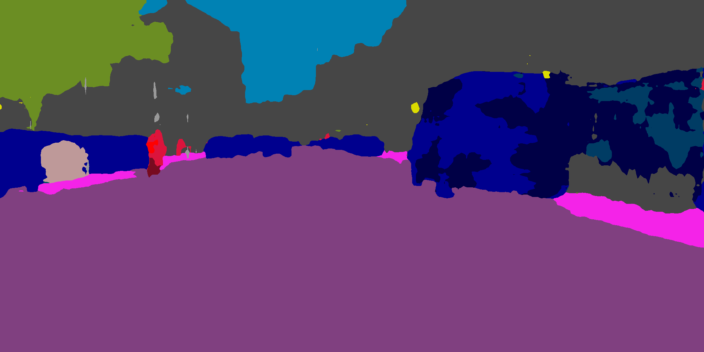
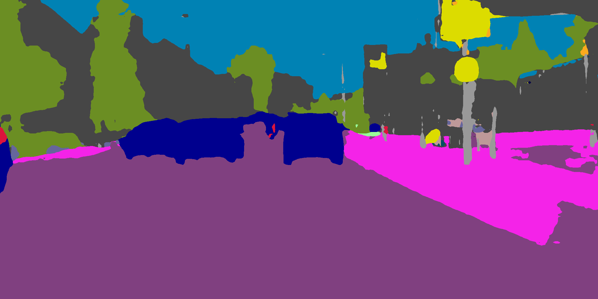
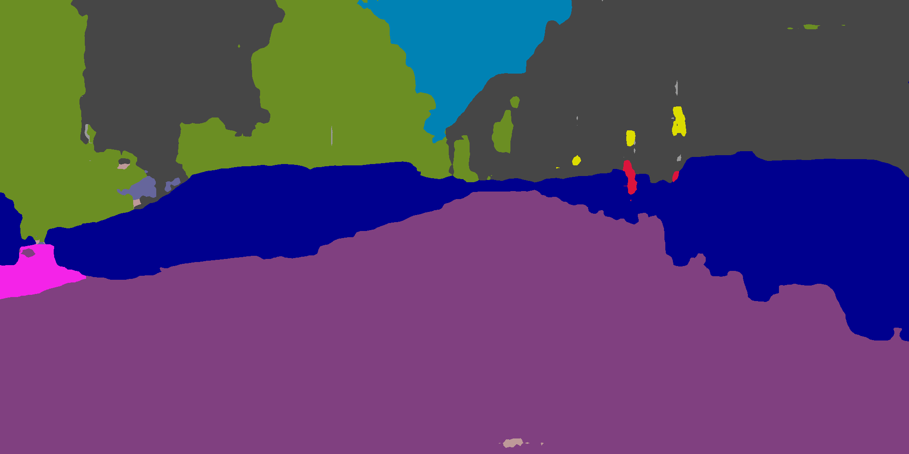
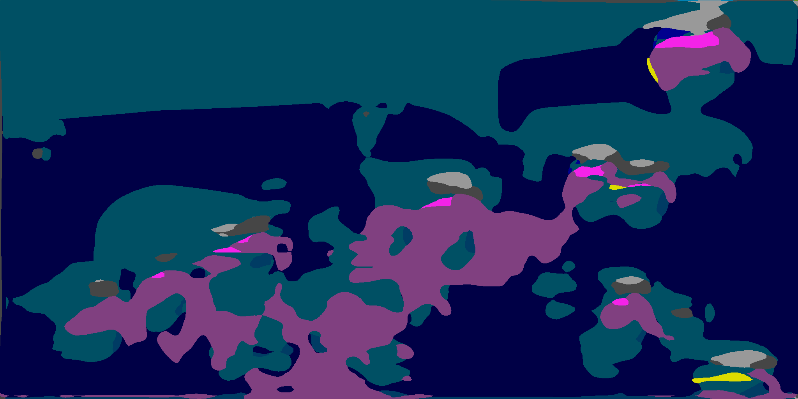
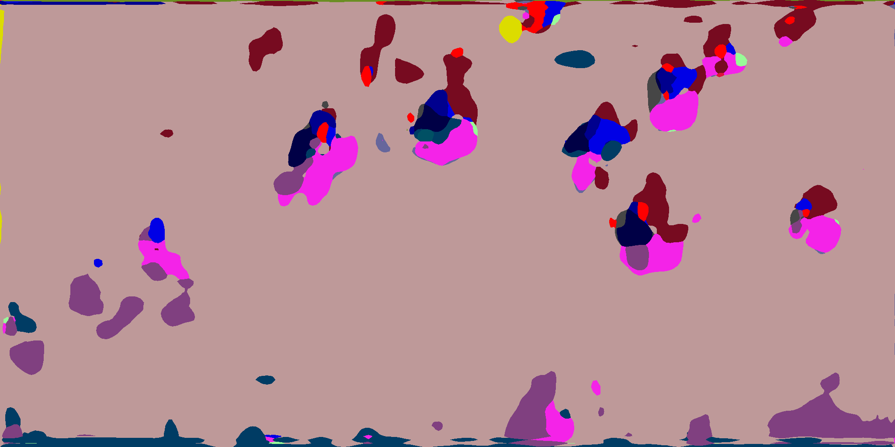

# Faulty Output Dataset

**Faulty Output Dataset (FOD)** is a custom dataset, developed to evaluate fault detection metrics. The dataset is created by injecting permanent faults in the synaptic weights of the [Fast-SCNN](https://github.com/Tramac/Fast-SCNN-pytorch) network and processing images taken from the [Cityscapes](https://www.cityscapes-dataset.com/) validation partition, made of 500 labelled images. Faults are generated through Statistical Fault Injection (texttt{error} = 2%, confidence = 99%), selecting 8,439 faults at specific weights in the Fast-SCNN model, flipping the most significant bit in a randomly selected synaptic weight, thus significantly altering the parameter values due to the FP32 representation. From the 8439 × 500 faulty outputs, a total of random 68,001 image-fault pairs were selected.

## Dataset Examples

| Frame | Injection | mIoU | PA | Label | Clean Output | Faulty Output |
|:-----:|:---------:|:----:|:--:|:-----:|:------------:|:-------------:|
| 479 | 595 | 0.017 | 0.19 | 1 |  |  |
| 236 | 191 | 1.0 | 1.0 | 0 |  |  |
| 462 | 4273 | 0.98 | 1.0 | 0 |  |  |
| 295 | 9729 | 0.0048 | 0.082 | 1 |  |  |
| 189 | 3680 | 0.9 | 1.0 | 0 |  |  |
| 102 | 6016 | 1.0 | 1.0 | 0 |  |  |
| 398 | 7110 | 0.038 | 0.49 | 1 |  |  |
| 331 | 7844 | 0.019 | 0.11 | 1 |  |  |
| 10 | 1184 | 0.0062 | 0.035 | 1 | |  |
| 191 | 12040 | 0.99 | 1.0 | 0 |  |  |

The FOD dataset features a pronounced class prevalence, with 88.10% of the entries labeled as critical and 11.90% as non-critical. Additionally, a significant portion of the dataset 43.07% consists of masks where all pixels belong to a single class, most commonly 'road'. The remaining 56.93% comprises more complex masks with varying class distributions. The FOD dataset includes information on fault parameters, such as the frame index and the fault details (including the affected layer, tensor index, and bit position), as well as performance metrics such as mIoU and PA. However, these metrics are not used for labeling the faults. Instead, the labels are manually assigned based on whether the output mask is classified as critical (C) or non-critical (NC). To determine whether a mask is considered critical, we defined three heuristic rules. If at least one of these points is satisfied, the mask is labeled as critical. The three rules are as follows:

* **Uniform Class Labeling**: The mask consists of pixels that are all assigned to the same class, ensuring that every pixel in the mask is consistently labeled.
    
* **Large Spatially Continuous Misclassified Regions**: The mask contains large, spatially continuous areas of misclassified pixels, which disrupt the visual coherence of the segmented object, resulting in a distortion of its perceived shape.
    
* **Incorrect Classification of Specific Categories**: The mask includes contiguous regions of pixels from categories that involve the presence of a human being, spanning from class 11 (person) to class 18 (bicycle), that are incorrectly classified.

This custom FOD dataset serves as a foundation for evaluating the effectiveness of a new fault detection approach (visit [Segmentation Metrics](https://github.com/lorenzofezza00/segmentation_metrics)).

## Dataset Testing

The dataset is available on [Google Drive](https://drive.google.com/file/d/18IpnsJsNgoVc8_Ii94oiQSd5sP07GTpH/view?usp=sharing). By adding the shortcut to your Drive it is possible to test it on Google Colab with the link at the top of this README. You can also test it locally with [dataset_analysis.ipynb](./dataset_analysis.ipynb) notebook, which explains how to properly use the dataset.